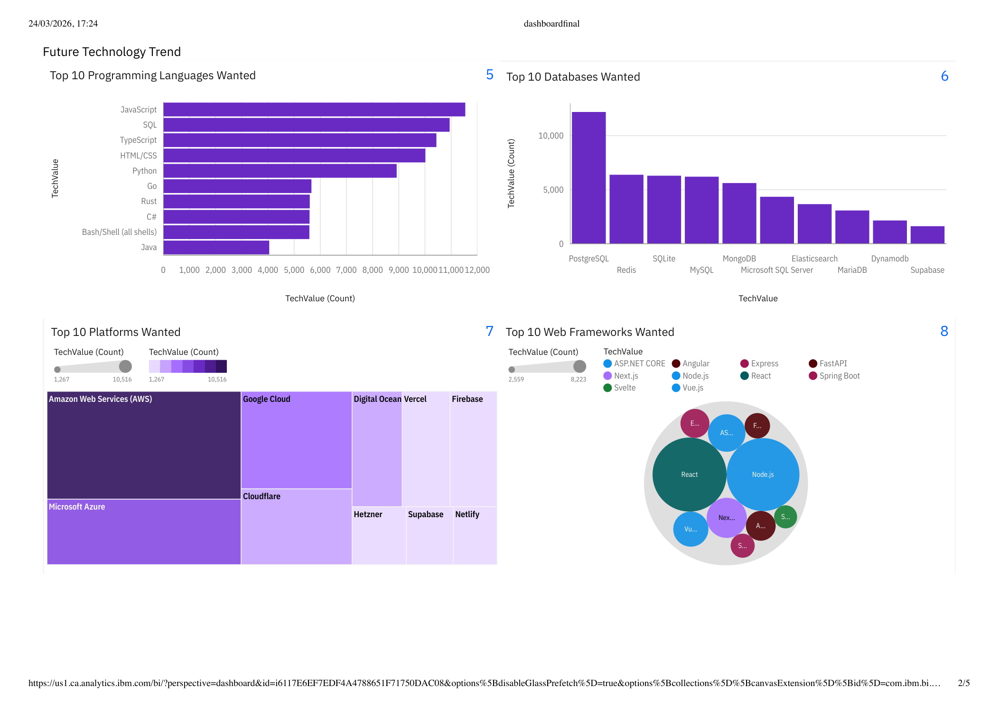
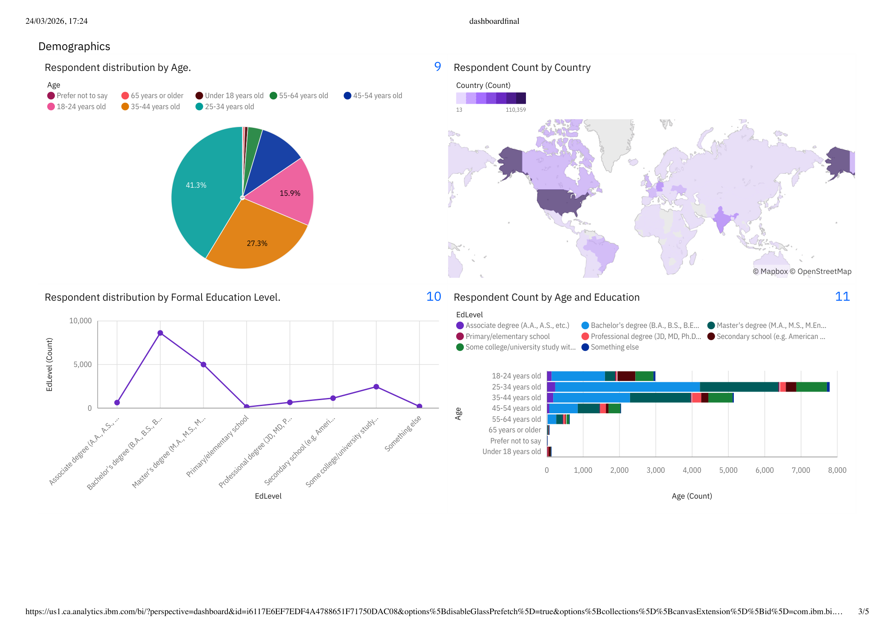
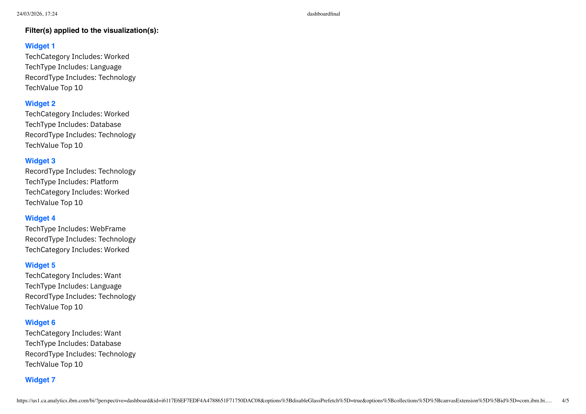
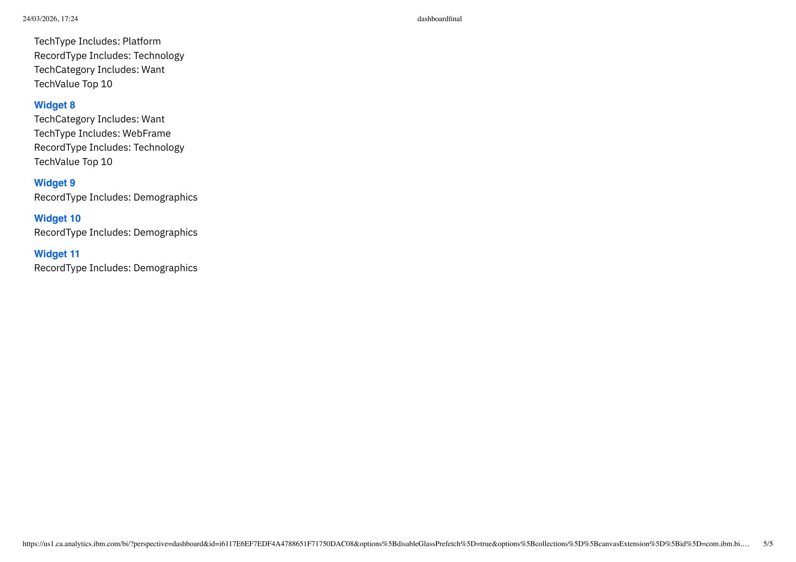

# Emerging Technology Trends Analysis

This project analyzes global developer survey data to identify current technology usage, future technology demand, and developer demographic patterns.

The goal is to transform raw developer survey data into a dashboard-ready format and use it to understand which programming languages, databases, platforms, and frameworks are currently popular, and which technologies developers want to work with in the future.

## Dashboard Preview

| Current Technology Usage | Future Technology Trends |
|---|---|
|  |  |

| Demographics Overview | Developer Profile Analysis |
|---|---|
|  |  |

| Dashboard Summary |
|---|
|  |

## Dashboard File

The complete dashboard is also included as a PDF:

```text
dashboardfinal.pdf
```

## Files in This Repository

```text
dashboard.ipynb                  Jupyter Notebook for data cleaning and dashboard data preparation
final_dashboard_sample.csv       Dashboard-ready sample dataset
dashboardfinal.pdf               Final dashboard PDF
emerging_tech_dashboard_01.png   Dashboard screenshot
emerging_tech_dashboard_02.png   Dashboard screenshot
emerging_tech_dashboard_03.png   Dashboard screenshot
emerging_tech_dashboard_04.png   Dashboard screenshot
emerging_tech_dashboard_05.png   Dashboard screenshot
README.md                        Project documentation
```

## Objectives

- Analyze current technology usage among developers.
- Identify future technology trends and preferences.
- Understand developer demographics such as age, country, and education.
- Clean and transform multi-value survey fields.
- Convert raw survey data into a structured dashboard-ready format.
- Present insights through a visual dashboard.

## Dataset

The project uses a developer survey dataset.

The raw dataset includes multi-value fields where one response may contain several technologies, for example:

```text
Python;JavaScript;SQL
```

These fields were transformed into a long-format structure so each technology can be analyzed individually.

A sample dashboard-ready dataset is included:

```text
final_dashboard_sample.csv
```

## Tools and Technologies

- Python
- Pandas
- Jupyter Notebook
- IBM Cognos Analytics
- CSV data processing
- Dashboard reporting

## Data Processing Workflow

### Data Cleaning

- Handled missing values.
- Removed inconsistencies in survey responses.
- Standardized technology and demographic fields.
- Prepared raw data for transformation.

### Data Transformation

- Split multi-value fields into individual rows.
- Converted wide-format survey responses into long-format data.
- Created structured fields for technology category, usage type, and demographic information.
- Combined worked-with technologies, desired technologies, and demographics into dashboard-ready data.

### Dashboard Preparation

- Created a final sample dataset for dashboard building.
- Prepared fields for current technology usage analysis.
- Prepared fields for future trend analysis.
- Prepared demographic fields for comparison and segmentation.

## Dashboard Sections

### Current Technology Usage

Analyzes technologies developers currently work with, including programming languages, databases, platforms, and frameworks.

### Future Technology Trends

Shows technologies developers want to work with in the future, helping identify demand and growth potential.

### Developer Demographics

Explores respondent distribution by age group, country, and education level.

## Key Insights

- JavaScript, SQL, and Python are among the most widely used technologies.
- Cloud platforms such as AWS, Azure, and Google Cloud show strong usage and future demand.
- Modern frameworks such as React and Node.js show strong developer adoption.
- A large share of developers fall within the 25-34 age group.
- Multi-value survey data needs careful restructuring before it can be used for dashboard analysis.

## How to Use This Project

Clone the repository:

```bash
git clone https://github.com/aishidutta13/Emerging-Technology-Trends-Analysis.git
cd Emerging-Technology-Trends-Analysis
```

Open the notebook:

```text
dashboard.ipynb
```

Open the dashboard PDF:

```text
dashboardfinal.pdf
```

Use the sample dataset:

```text
final_dashboard_sample.csv
```

## Current Limitations

- Only a sample dashboard-ready dataset is included due to file size limits.
- The dashboard is provided as a PDF and images, not as a live interactive web dashboard.
- Raw survey data may need to be regenerated or downloaded separately.

## Future Improvements

- Add a live interactive dashboard.
- Add more detailed trend comparisons between current and desired technologies.
- Include year-over-year analysis if multiple survey years are available.
- Build an interactive dashboard using Streamlit, Plotly, or Power BI.
- Add automated data cleaning scripts.

## Conclusion

This project demonstrates a complete data analytics workflow from raw developer survey data to dashboard-ready insights. It highlights practical skills in data cleaning, transformation, dashboard preparation, and technology trend analysis.

## Author

Aishi Dutta

GitHub: [aishidutta13](https://github.com/aishidutta13)
